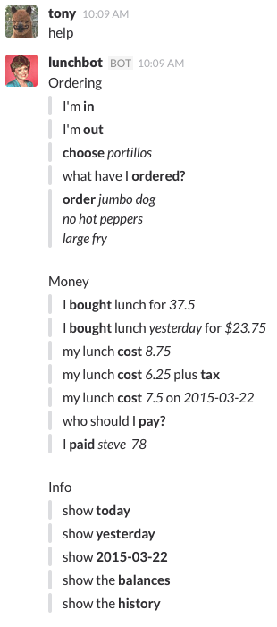

# lunchbot Commands

Ask lunchbot for `help` to get a list of commands. You don't have to type out the whole phrase, just the important parts.

You can issue commands in your direct message channel with the bot or you can issue commands in your team's `#lunch` channel by including the name of your bot.

