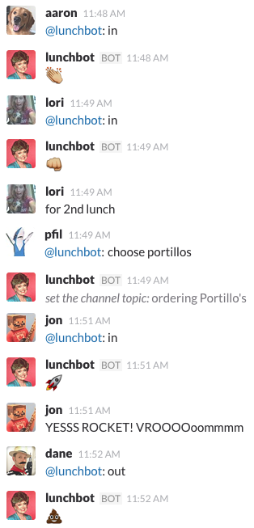
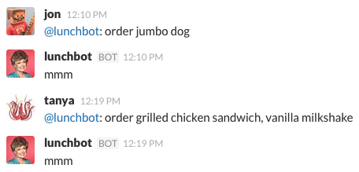
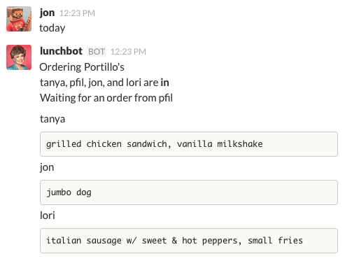
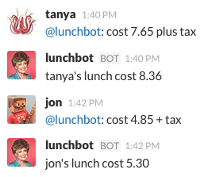
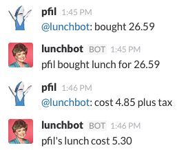
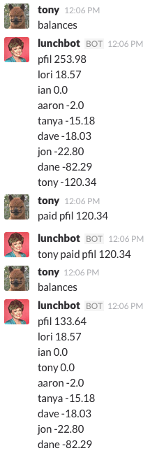

# lunchbot Walkthrough

Start the day by telling lunchbot if you're in or out for lunch and the restaurant you'll be ordering from.

---
Tell lunchbot your order 

and when you're ready to call it in, you can bring up a summary.

---
Tell lunchbot the cost of your lunch.

---
If you bought the lunch, tell lunchbot how much you paid as well as the cost of your own lunch.

---
When you're ready to pay off your debt you can check the balances. You generally want to just
pay your entire debt to the person with the largest balance. Go send a Square Cash or something and then tell lunchbot about it.

